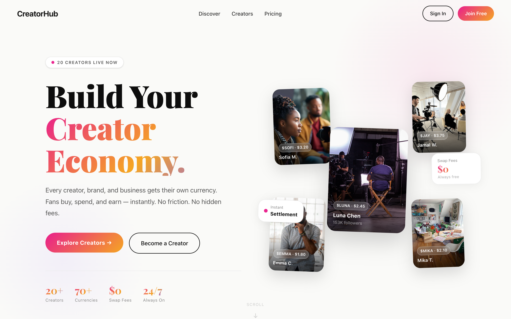

<div align="center">

# Creator Storefront

### Launch a creator marketplace — bookable services, creator profiles, and a fan-token economy — from one full-stack TypeScript starter.

<a href="#"></a>
<a href="#"></a>
<a href="#"></a>
<a href="./LICENSE"></a>

</div>

<div align="center"></div>

---

**Creator Storefront** (CreatorHub) is a fork-and-ship starter for the creator economy. Every creator launches a public profile, a roster of **bookable services**, and a **personal fan token** — and fans buy those tokens, book sessions, and track a live portfolio with real profit-and-loss. The entire token economy runs as a **simulated in-database ledger** out of the box (no blockchain, no wallets, no audits) behind a single swappable settlement adapter, so the day you want to go on-chain you swap one file instead of rewriting the app.

It's built for indie devs, founders, and creator-economy teams who want a complete, readable React + tRPC + Drizzle reference app — with real ledger logic, OAuth, a creator dashboard, and a hand-crafted marketing landing page — instead of a blank repo.

**Self-hosted. Your brand, your data, your infrastructure — and your settlement rail when you decide to plug one in.**

## What you can build

- **A bookings page for a streamer, coach, or consultant.** List coaching calls, 1-on-1s, or shoutouts with a price, duration, and category; let fans reserve a slot via a date/time picker; run accept / decline / complete / cancel from a dashboard — without writing the backend.
- **A social-token / fan-currency prototype.** Demo the full launch-a-token → buy → hold → cash-out loop on the DB ledger, with weighted invested/spent tracking and live portfolio P&L, then swap in a real settlement adapter when you go on-chain.
- **A multi-creator marketplace for an agency or platform.** Seed a roster of storefronts with services, categories, and per-creator tokens, and run a searchable, category-filtered front end across all of them.
- **A token-gated membership concept.** Gate sessions behind holding a creator's token instead of a flat subscription; every fan's holdings live in their wallet with current value and gain/loss.
- **A no-blockchain MVP.** Validate demand for paid creator services and tokenized fan engagement on realistic seed data before paying for contracts or audits.
- **A reskinnable niche marketplace.** Fitness trainers, music producers, tutors, podcasters — change one branding config to rebrand without touching core logic.
- **A hackathon or course project.** A complete, high-craft full-stack app to learn from or fork.

## Features

Everything below is implemented and wired unless the **Status** section says otherwise.

### Creators

- **Two-step creator onboarding wizard.** Step 1 builds the profile (bio, category, profile photo, Twitter / Instagram / website) and on success promotes the user's role from `fan` to `creator`. Step 2 launches the token, with a live preview card showing the chosen name, symbol, and price. A progress stepper with checkmarks tracks the flow. *(Profile-photo "upload" is a client-side `FileReader` base64 data URL — explicitly TODO'd to wire real S3.)*
- **Creator token launch (own branded currency).** Creates a `creator_tokens` row with `tokenName`, `tokenSymbol` (uppercased, max 10 chars), an `initialPrice` in USDT, and a hardcoded `totalSupply` of 1,000,000. `currentPrice` seeds equal to `initialPrice`. The launch routes through `settlementAdapter.deployToken()` first (which returns `simulated: true` with null on-chain fields), so the exact same flow can later deploy a real ERC-20.
- **Creator dashboard with live stats + booking management.** Four stat cards — token balance the creator holds of their own token, total revenue, total bookings, total fans — plus a dialog to add services (title, description, token price, duration in minutes, category). Booking cards show fan name, scheduled date/time, token amount, and a color-coded status; pending bookings get **Accept / Decline** buttons, and `updateBookingStatus` supports `accepted` / `declined` / `completed` / `cancelled`.
- **Aggregated creator stats computed in SQL.** `getCreatorStats` returns `tokenBalance` (the creator's own holding), `totalRevenue` (SUM of `totalValue` across the creator's `cashout` transactions), `totalBookings` (COUNT), and `totalFans` (COUNT DISTINCT of fans who booked) — degrading gracefully to zeros if the DB is unavailable.
- **Creator cash-out.** `creator.cashout` zeroes the creator's entire holding of their own token and writes a `cashout` transaction valued at `balance × currentPrice` (this is what feeds `totalRevenue`). It returns `NOT_FOUND` with no token and `BAD_REQUEST` on a zero balance; the dashboard button disables at zero.
- **Creator analytics dashboard.** Recharts line (revenue over time), bar (token sales), and pie (bookings by service), plus a Top Fans list and insight cards (token velocity, average transaction, growth rate). The four top KPI cards (revenue, tokens sold, bookings, fans) are **real** from `getStats`; the chart series and insight numbers are hardcoded sample data (see Status).

### Fans

- **Fan buys creator tokens (simulated ledger).** `fan.buyTokens` upserts a `token_holdings` row (balance, average buy price, total invested, total spent), writes a `buy` transaction with `totalValue = amount × pricePerToken`, and increments `creatorTokens.circulatingSupply` via raw SQL. The storefront dialog shows a live "you'll receive ≈ amount / price" estimate and a transaction summary. *(Note the buy-amount semantics in Status — the input is in USDT but is stored as the token amount.)*
- **Service booking with date/time picker.** `fan.bookService` takes a `serviceId`, an ISO `scheduledAt`, and optional notes; it creates a `pending` booking with `tokenAmount` copied from the service's `tokenPrice` and increments `services.totalBookings`. The dialog enforces a minimum date of today, assembles `scheduledAt` from separate date and time inputs, and shows a summary (service, duration, price in the creator's token symbol).
- **Fan wallet / portfolio with live P&L.** The Wallet page computes total portfolio value (Σ `balance × currentPrice`), total invested, and absolute + percentage profit/loss — both portfolio-wide and per holding. Per-holding cards show balance, current price (4 dp), current value, P/L with green/red styling, and a deep link to `/creator/:creatorId`. All three wallet queries are gated on authentication.
- **Transaction history + upcoming bookings.** The Wallet shows the last 10 transactions with `buy` (green down arrow) / `sell` (red up arrow) / other (coins) iconography, timestamps, amount, and USD value, plus upcoming bookings (excluding completed/cancelled, capped at 5) with service title, creator name, date/time, and a status pill.

### Marketplace & discovery

- **Bespoke editorial landing page.** `Home.tsx` is a ~1,140-line hand-built marketing page (Playfair Display + Inter) with a live-creator badge, animated floating creator cards with token-price badges, gradient text and ambient blobs, `IntersectionObserver` scroll-reveals, a **300vh sticky-scroll three-panel feature section** whose active panel (Swap / Spend / Yield) is driven by scroll math, a network-viz section, a bento featured-creators grid, a scroll-driven category filter, How-It-Works, For-Fans / For-Creators sections, an earnings mockup, a marquee, testimonials, CTA, and footer — all hydrated with **real creator data** via `getCreators` / `getFeaturedCreators`.
- **Discover marketplace with search + category filter.** `fan.getCreators` does a server-side `LIKE` search across creator name, bio, and category plus an exact category filter, ordered by `featured DESC` then `totalBookings DESC`. The Discover page has a search box, 8 category pills (Gaming / Fitness / Education / Music / Art / Coaching / Tech / Business), a separate Featured Creators row (hidden while searching), and an empty state.
- **Public single-creator storefront.** `/creator/:id` renders a header (avatar or fallback, verified checkmark, category pill, bio, follower / booking / rating stats, and Twitter / Instagram / website links that strip a leading `@` and build full URLs), a token info card (price + circulating / total supply + Buy button), and a services grid (per-service duration, booking count, price, Book Now). Unauthenticated buy or book attempts redirect to the OAuth login URL. *(Note: `getCreatorById` does **not** filter by role, so a direct `/creator/:id` works for any user id, while the marketplace listing requires `role = 'creator'` — different gating for list vs. detail.)*

### Platform, auth & architecture

- **Pluggable settlement adapter seam — the standout.** The whole on-chain story sits behind one `ISettlementAdapter` (`deployToken` / `transfer` / `cashOut`), with a production-ready `SimulatedSettlementAdapter` default that does no on-chain work and returns `simulated: true`. The schema already carries every blockchain column — `contractAddress`, `settlementListingId`, `liquidityPoolAddress`, `deployedAt`, and `transactionHash` on bookings/transactions — plus an entire `liquidity_pools` table, all nullable and unused in simulated mode. Interface docstrings name Uniswap V3 / Circle USDC / USDT-Tron as wiring targets. "Go on-chain" is a one-adapter swap, not a rewrite.
- **OAuth / OIDC auth with role-based access.** `GET /api/oauth/callback` exchanges code → token, fetches userinfo, upserts the user, and mints a 1-year JWT session cookie. `getLoginUrl()` builds the portal URL on the client so the redirect URI matches the current origin. Roles are a 4-way enum — `user` / `admin` / `creator` / `fan` (default `fan`) — with `OWNER_OPEN_ID` auto-promoted to `admin` on upsert. tRPC ships `publicProcedure`, `protectedProcedure` (requires a user), and `adminProcedure` (`role === 'admin'`); the Dashboard and Analytics pages gate on `role === 'creator'`.
- **DB-resilient data layer.** `getDb()` connects lazily and returns `null` when `DATABASE_URL` is unset; every query and helper degrades gracefully (returns `[]`, `undefined`, or zeroed stats) instead of throwing, so the app boots without a database — queries just return empty.
- **System router + owner notification.** `systemRouter` exposes a public, timestamp-validated health check and an admin-only `notifyOwner` mutation that pushes a title/content message to the platform owner.
- **AI / image / storage scaffolding (in the box, not yet wired).** `_core` ships OpenAI-compatible chat types (image/file/tool content), a `generateImage` helper with edit support, and an S3/R2 storage adapter, plus a polished `AIChatBox` component with Streamdown markdown rendering and auto-scroll — everything you need to wire an AI concierge, though no current feature uses it.
- **One-file rebranding config.** `client/src/config/branding.ts` centralizes `PLATFORM_NAME` (`CreatorHub`), `CREATORS_TERM`, `TAGLINE`, `CURRENCY_TERM`, `PLATFORM_FEE_PCT` (`15%`), and `BRAND_COLORS` (violet / amber / pink) with a derived `BRAND_GRADIENT`, intended to mirror the CSS custom properties in `index.css`.
- **Seed roster of 20 demo creators.** `server/data/creators.json` holds 20 creators across 16 categories (Gaming, Fitness, Music, Art, Education, Coaching, Tech, Beauty, Dance, Design, Fashion, Food, Grooming, Photography, Podcast, Writing), each with a bio, photo, currency name / symbol / price, follower and customer counts, social links, and a list of priced services. `seed-creators.mjs` (run via `node server/seed-creators.mjs`) inserts users + profiles + tokens (`totalSupply` 1M, circulating = customers × 50) + services. *(See Status — the seeded role/featured values are out of sync with the listing queries.)*

> **Note:** Creators get **both** a token **and** bookable services — this is a marketplace + token ledger, not just a token launchpad. The schema is richer than the UI exposes: services carry `availability` (JSON), `isActive`, `maxBookingsPerDay`, and `imageUrl`; bookings carry `meetingLink` and `calendarEventId`; transactions support 5 types (`buy` / `sell` / `transfer` / `payment` / `cashout`) and 3 statuses — current flows only write `buy` and `cashout`.

## Tech stack

- **Frontend** — React 18 + Vite, Wouter (routing), Tailwind CSS, shadcn/ui (Radix), Recharts (charts), Streamdown (markdown), TanStack Query via tRPC React.
- **API** — Express + tRPC (superjson), type-safe end to end.
- **Data** — Drizzle ORM over MySQL (`mysql2`).
- **Auth** — OAuth / OIDC with JWT session cookies.
- **Build & test** — esbuild (server) + Vite (client); Vitest for tests.
- **Optional** — AWS S3 SDK, plus LLM / image-generation / storage proxy scaffolds in `_core`.

## Quickstart

Requires Node 18+ and a reachable MySQL database.

```bash
# 1. Clone
git clone <your-fork-url> creator-storefront
cd creator-storefront

# 2. Install
npm install

# 3. Configure — fill in the required vars (see table below)
cp .env.example .env

# 4. Create tables and seed the demo roster
npm run db:push
node server/seed-creators.mjs

# 5. Run
npm run dev                  # dev server with hot reload
# or
npm run build && npm start   # production build
```

Sign in through your OAuth provider to reach the marketplace. **Heads up:** as shipped, the seed script writes creators with `role = 'user'` and `featured = 0`, while the listing queries require `role = 'creator'` / `featured = true` — so freshly-seeded creators won't appear in Discover/Home until you fix those values (their direct `/creator/:id` pages still load). See Status.

## Configuration

Full annotations live in `.env.example`. The schema is MySQL/Drizzle and ships with an in-file POSTGRES note for converting to `pg-core` if you prefer Postgres.

| Variable | Required | What it does |
| --- | --- | --- |
| `DATABASE_URL` | **Yes** | MySQL connection string (`mysql2` format). Without it, `getDb()` returns `null` and every query returns empty. |
| `JWT_SECRET` | **Yes** | Secret signing session cookies. Must be **≥ 32 chars** or auth throws at boot. |
| `VITE_APP_ID` | **Yes** | OAuth client / app ID from your OIDC provider. |
| `OAUTH_SERVER_URL` | **Yes** | Base URL of your OIDC provider. |
| `VITE_OAUTH_PORTAL_URL` | No | Custom login portal URL the frontend redirects to. |
| `OWNER_OPEN_ID` | No | `openId` auto-granted the `admin` role on upsert. |
| `LLM_API_BASE_URL` / `LLM_API_KEY` | No | OpenAI-compatible endpoint for the AI scaffolds (see Status). |
| `STORAGE_BASE_URL` / `STORAGE_API_KEY` | No | S3-compatible proxy for uploads. |
| `STORAGE_BUCKET` / `AWS_*` | No | Direct object storage for the AWS S3 / R2 storage adapter. |

Provider-specific code is isolated behind interfaces in `server/adapters/`, so you can swap implementations without touching app logic:

| Adapter | Default | Swap in |
| --- | --- | --- |
| `settlement` | `SimulatedSettlementAdapter` (pure DB ledger) | A real EVM/DEX adapter returning a contract address + tx hash (Uniswap V3 / Circle USDC / USDT-Tron are the named targets) |
| `storage` | S3-compatible HTTP proxy | AWS S3 / R2 direct adapter |
| `llm` / image | OpenAI-compatible endpoint | Any compatible chat / vision provider |

## Make it yours

1. **Rebrand in one file.** `client/src/config/branding.ts` holds the platform name, the term for "creator," the tagline, the word for tokens, the platform fee, and brand colors (mirrored as CSS variables in `index.css`).
2. **Reseed the roster.** Edit `server/data/creators.json` and re-run `node server/seed-creators.mjs` to ship your own creators, services, and categories. (If you want them in the listings, set `role = 'creator'` and `featured` appropriately — see Status.)
3. **Go on-chain when ready.** Implement `ISettlementAdapter` in `server/adapters/settlement/` and expose a `transfer` tRPC route to move from the simulated ledger to real token settlement and fan-to-fan transfers. The schema columns and `liquidity_pools` table are already there.
4. **Wire the AI concierge.** `AIChatBox`, the `_core` LLM/image helpers, and the storage adapter are ready — add a tRPC route and set the keys.

## Status — what's real vs. stubbed

The marketplace loop works end to end against the database — but it's a **ledger, not a chain**. Be honest with yourself about these before shipping anything money-real:

- **No blockchain by default.** All tokens, prices, supply, buys, and cash-outs are a MySQL ledger via `SimulatedSettlementAdapter` (returns `simulated: true`, null on-chain fields). There is **no AMM or bonding curve**: `currentPrice` never moves from the launch price; `circulatingSupply` increments but price is static.
- **Buy-amount semantics mismatch (a real bug, not cosmetic).** The Buy dialog asks for an amount in USDT and shows "you'll receive ≈ amount / price tokens," but `fan.buyTokens` passes that USDT figure straight through as the token `amount` to the ledger (`balance += amount`, `totalValue = amount × price`). So the stored balance is the USDT number, not the token-equivalent shown in the UI.
- **Seed is out of sync with the listing queries (a real bug).** `seed-creators.mjs` inserts users with `role = 'user'` and profiles with `featured = 0`, but `getAllCreators` filters `role = 'creator'` and `getFeaturedCreators` filters `featured = true`. As shipped, freshly-seeded creators do **not** appear in Discover / Home or the Featured row (direct `/creator/:id` pages still load). Fix the role/featured values when seeding.
- **Analytics charts are hardcoded sample data.** The four top KPI cards are live from `getStats`; every chart series, the Top Fans list, and the velocity / avg-transaction / growth insights are placeholders (no `creator_analytics` aggregation is implemented despite the table existing).
- **Profile photo upload is fake.** It's a client-side `FileReader` base64 data URL stored inline (explicit TODO to wire real S3). The S3/storage adapter exists but isn't connected to onboarding.
- **Cash-out is handled by the DB, not the adapter.** The settlement adapter's `cashOut` returns `usdAmount: '0'` and is bypassed — the real cash-out math lives in `db.cashoutTokens`, so a future real adapter must reconcile that.
- **AI / scaffold components aren't routed.** `AIChatBox`, `Map`, `ComponentShowcase`, `LoginDialog`, and the LLM / image / voice / storage helpers exist but are not used by any current feature — they're scaffolds in the box.
- **Bookings have no calendar/video integration yet.** `meetingLink` and `calendarEventId` columns exist but nothing populates them.
- **Some schema/UI fields have no backing mutation.** The Dashboard service "Edit" button and profile fields like `coverPhoto`, `youtubeChannel`, and `discordServer` exist but aren't wired.
- **A reachable MySQL DB is required for data.** Without `DATABASE_URL`, the app boots but every query returns empty.
- **Auth needs an external OAuth/OIDC provider.** It's not a self-contained email/magic-link system; it exchanges codes via your provider and needs the four required env vars.
- **Tests are minimal.** Effectively one `auth.logout` test (`auth.logout.test.ts`); no coverage of the token or booking flows.

## License

MIT © 2026 — see [LICENSE](./LICENSE). Fork it, rebrand it, ship it.
